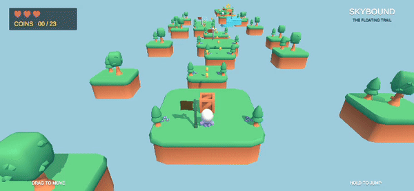

# Skybound — NumTalk Platformer

Mobile-first 3D platformer prototype for the NumTalk Unity Developer Assignment, built with Unity `6000.5.0f1`, URP, and Arch ECS. Target: Android.

## Preview

Click the animated preview to [watch the full gameplay video with audio](https://github.com/vovasazonov/numtalk-test/blob/master/preview.mp4).

## Download

Download the Android APK from the [v1.0.0 release](https://github.com/vovasazonov/numtalk-test/releases/tag/1.0.0).

## Run

1. Open `NumTalkClient` with Unity `6000.5.0f1` and allow package restoration and asset import to finish.
2. Open `Assets/Project/EntryDomain/Scenes/EntryScene.unity` and press Play.
3. On device, use the floating left stick to move and the right-side control to jump.

## Gameplay

One course with moving, ice, and crumble platforms, a ridable crate, enemies, coins, checkpoints, three lives, and restart. Movement includes variable-height jumping, coyote time, and jump buffering.

Visuals and audio were a priority. Asset credits are in [ASSET_SOURCES.md](ASSET_SOURCES.md).

## Development

I reused my previously developed project foundation, including the core, screens, domains, and ECS architecture. AI developed the platformer features and integrated art and audio under my direction; all folders under `Features/` were developed by AI.

See [DECISIONS.md](DECISIONS.md) for architecture, the Android fix, and skipped work.
